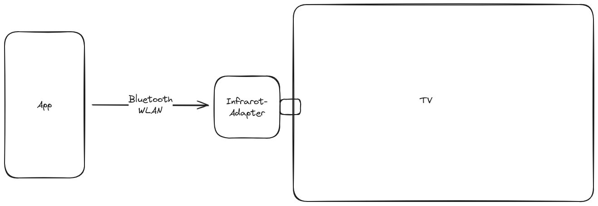

# kk-sendir

## Idea

Several smartphones with the `app` are able to communicate to the IR adapter.

---

## Todo

- powercontrol?
- app
    - design
        - userinterface
        - gesture detector
        - animation controller
        - remote control
    - connection to back-end
    - architecture
- devices
    - micro controller
    - IR emitter/receiver/transceiver

## Programming IR-Transceiver
- Links:
    - https://learn.sparkfun.com/tutorials/ir-communication/all (Explanation of basics)
    - https://www.heise.de/hintergrund/Arduino-Multifunction-Shield-Infrarot-Fernbedienung-als-Steuerung-4844899.html (~)
      
    - https://github.com/Lime-Parallelogram/pyIR (Python Code for IR-Receiver: Repo)
    - https://mc.mikrocontroller.com/de/IR-Protokolle.php (Explanation of some protocols)
- Protocols:
    - meistbenutzte Protokolle nutzen
 
## Powercontrol
- Pi Pico power consumption: Idle= 0.16W
- Possible power sources:
  - Cable (5V)
  - Battery
    - AA Batteries (4xAA ca. 27Tage[Idle])
    - Battery-Pack
## App-Design

### Structure
- Various Screens (Modes/Remotes/Devices/Add new devices)
- Different Devices (for multiple Adapters)
- Remote design (Custom GridView with Keys)

#### Possible Design:

### Features
- Two modes:
  - Emitting-Mode
- Connecting to Station with BLE
- Sending default Keys to Station
#### Upcoming features
- Creating different "Remotes" (Storing different key combinations for various devices)
- Connecting via WiFi
- sharing the device to others
- adding Devices already in the local network

## Devices

- ESP32 with USB-C port (Akku?)
- (IR-Emitter)
- (IR-Receiver)
- LED
